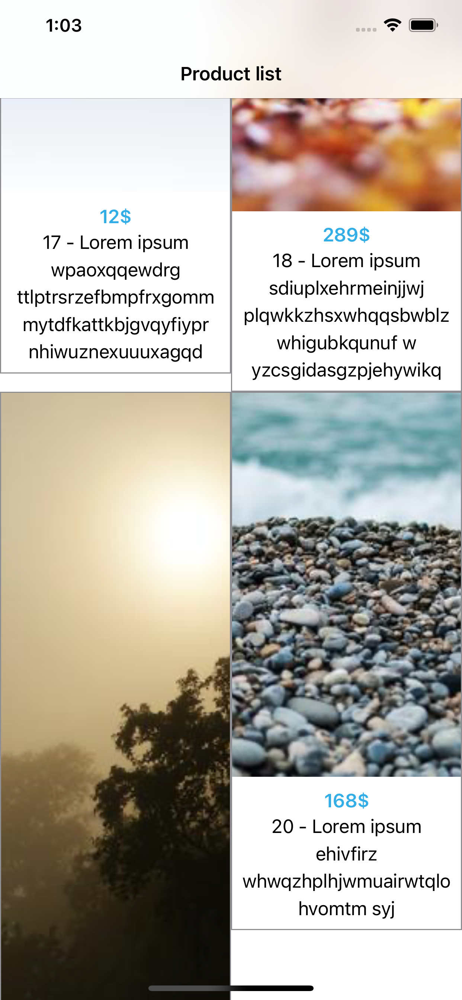
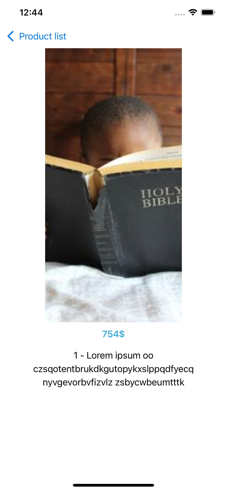
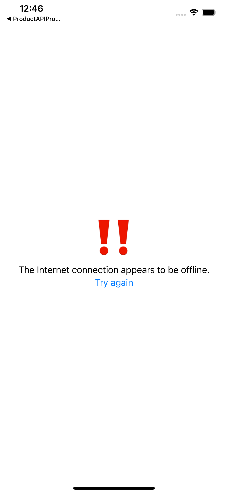

# Thirdwayv-iOS-Collection-View-Challenge

In this app: 

- Created a mock API that returns the data that exist in the attached JSON file using Myjson.
- Connected the mock API and displays a list of products.
- The products are displayed in a `UICollectionView` using LazyHGrid in swiftUI .
- When a product is selected, a new product details view should be displayed.
- Applied the concept of cashing. 
- Wrote the unit test cases and genetated the code average.

What makes this app unique? 

- Created it and implemented collection view using swiftUI.  
- Applied animation between product list page and product details page.
- Used combine library 
- Open to anyone to learn the concept of cashing (How make your app interact when internet connection is on or off)

## The App 3 main pages:
[1] Home Product page.

[2] Product Details page.

[3] Error page when there is no internet connection.

## Home Product page

   

## Product Details page

  

## Error page when there is no internet connection

  

